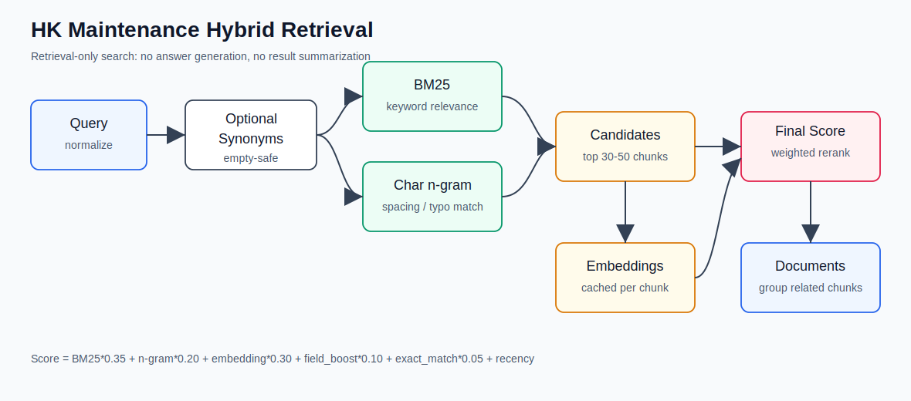
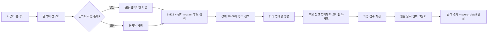
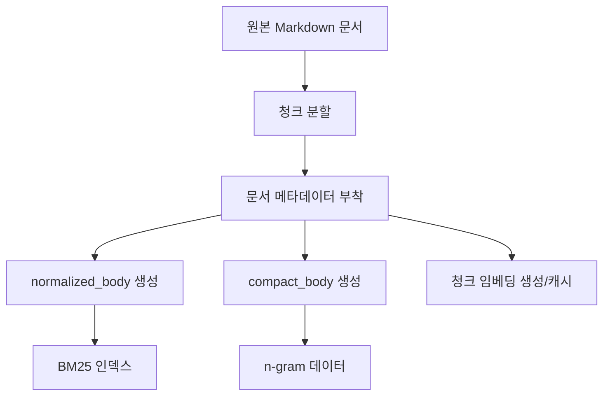
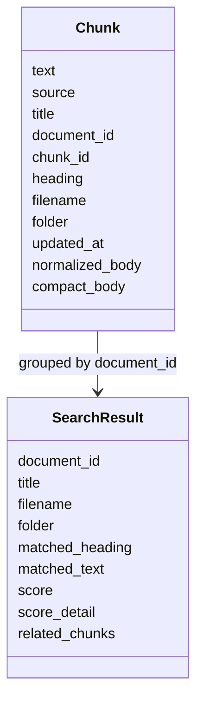
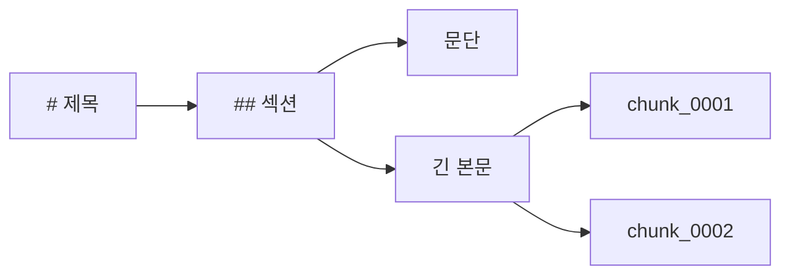
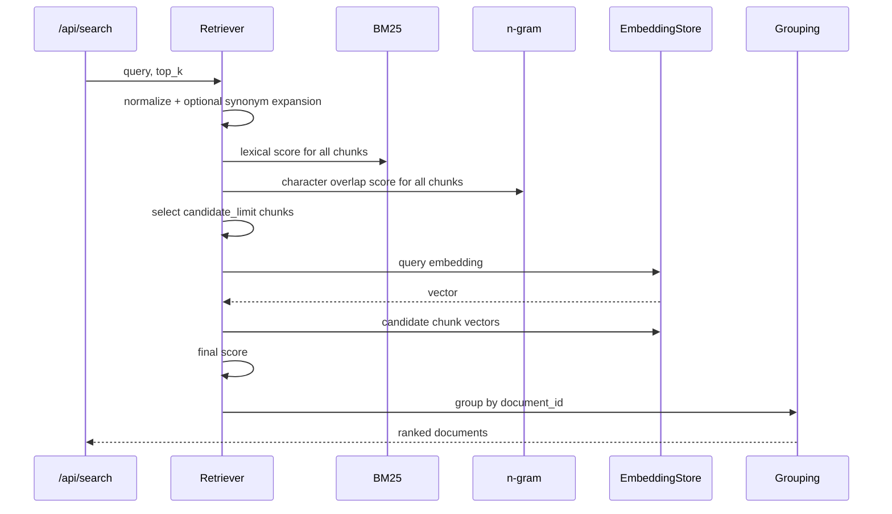
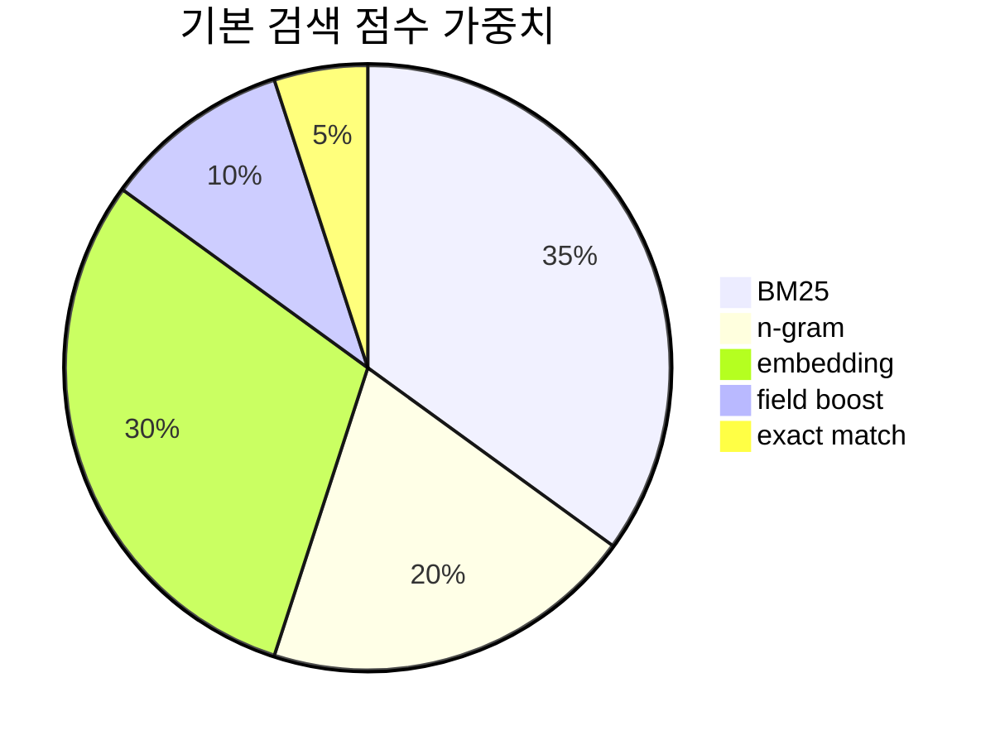
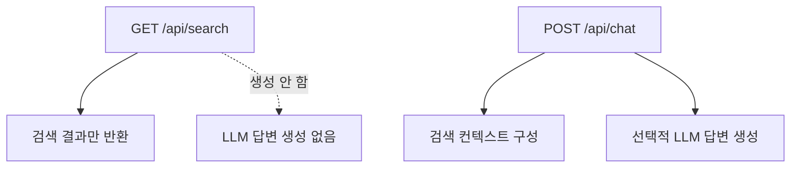

# HK Maintenance Hybrid Retrieval System



## 초록

본 문서는 HK Maintenance 백엔드의 현재 문서 검색 구조를 논문 형식으로 정리한다. 시스템의 목표는 LLM 답변 생성이 아니라, 유지보수 문서에서 관련 원문 문서를 정확히 검색하는 것이다. 검색기는 BM25, 문자 n-gram 유사도, 청크 임베딩 유사도를 결합한 하이브리드 검색 구조를 사용하며, 결과는 청크 단위로 계산한 뒤 원본 문서 단위로 병합한다.

`GET /api/search`는 자연어 답변이나 요약을 생성하지 않는다. 이 엔드포인트는 검색 결과와 디버깅용 점수 상세만 반환한다.

## 1. 문제 정의

유지보수 문서 검색은 일반적인 키워드 검색만으로 충분하지 않다. 한국어 업무 문서에는 띄어쓰기 차이, 조사와 어미 변화, 약어, 오타, 영문/한글 혼용 표현이 자주 나타난다.

예를 들어 사용자는 `물이 새요`라고 검색하지만 문서에는 `누수 조치 내역`으로 기록될 수 있다. 또는 `엘베 고장`은 `승강기 유지보수` 문서와 연결되어야 한다. 따라서 현재 구조는 다음 세 가지 신호를 결합한다.

| 신호 | 목적 | 구현 위치 |
|---|---|---|
| BM25 | 정확한 키워드 기반 관련도 | [rag.py](./rag.py) `BM25Okapi` |
| 문자 n-gram | 오타, 부분 일치, 띄어쓰기 차이 보정 | [rag.py](./rag.py) `char_ngram_tokens` |
| 임베딩 유사도 | 후보 청크 재순위화 | [rag.py](./rag.py) `EmbeddingStore` |

## 2. 전체 아키텍처



문서 업로드 또는 갱신 시에는 원문을 직접 수정하지 않고 검색용 필드만 별도로 만든다.



## 3. 데이터 모델

검색 단위는 원본 문서가 아니라 청크다. 그러나 사용자에게 반환되는 최상위 결과는 원본 문서 단위다.



`Chunk` 모델은 [models.py](./models.py)에 정의되어 있다. 주요 필드는 다음과 같다.

| 필드 | 설명 |
|---|---|
| `document_id` | 원본 문서 식별자 |
| `chunk_id` | 청크 식별자 |
| `heading` | 청크가 속한 Markdown heading |
| `filename` | 원본 파일명 |
| `folder` | 문서 폴더 |
| `normalized_body` | 검색용 정규화 본문 |
| `compact_body` | 공백 제거 검색용 본문 |

## 4. 정규화

정규화 함수는 [rag.py](./rag.py)의 `normalize_search_text`에 있다.

정규화 규칙은 다음과 같다.

| 입력 특징 | 처리 |
|---|---|
| 영문 대소문자 | 소문자로 변환 |
| `A/S`, `AS`, `a.s`, `에이에스` | `as`로 통일 |
| 특수문자 | 검색에 불필요한 문자는 공백 처리 |
| 다중 공백 | 단일 공백으로 축약 |
| 한국어/영문/숫자 | 유지 |
| 원본 문서 | 수정하지 않음 |

예시:

```txt
원문: A/S request received and air conditioner filter replacement completed
정규화: as request received and air conditioner filter replacement completed
공백 제거: asrequestreceivedandairconditionerfilterreplacementcompleted
```

## 5. 청크 분할

문서 분할은 [rag.py](./rag.py)의 `split_markdown`에서 수행한다.

현재 청크 전략:

1. Markdown heading을 기준으로 섹션을 분리한다.
2. 긴 섹션은 최대 길이 기준으로 다시 나눈다.
3. 각 청크에 원본 문서 메타데이터를 붙인다.
4. 검색용 정규화 필드를 별도로 생성한다.



## 6. 후보 검색

후보 검색은 [rag.py](./rag.py)의 `_hybrid_search`에서 수행한다. 먼저 전체 청크에 대해 BM25와 n-gram 점수를 계산하고, 이 둘을 이용해 임베딩 비교 대상 후보를 제한한다.



후보 제한은 성능상 중요하다. 임베딩 유사도는 모든 문서에 대해 매번 계산하지 않고, BM25와 n-gram으로 고른 상위 후보에 대해서만 계산한다.

## 7. BM25

BM25는 정확한 키워드 일치에 강하다. 구현은 순수 Python `BM25Okapi` 클래스다.

기본 파라미터:

```txt
k1 = 1.5
b = 0.75
```

검색 대상 필드:

| 필드 |
|---|
| chunk body |
| heading |
| title |
| filename |
| folder |

점수는 후보 청크 집합에서 0-1 범위로 정규화한다.

## 8. 문자 n-gram

문자 n-gram은 한국어 유지보수 문서 검색에서 중요한 보정 신호다.

처리 방식:

1. 한국어는 2-gram, 3-gram을 만든다.
2. 영문과 숫자는 단어 토큰을 유지한다.
3. 정규화 텍스트와 공백 제거 텍스트를 모두 비교한다.
4. Jaccard similarity로 0-1 점수를 계산한다.

예시:

```txt
검색어: 물이 새요
n-gram: 물이, 이새, 새요, 물이새, 이새요 ...
```

## 9. 임베딩 유사도

임베딩은 답변 생성에 사용하지 않는다. 현재 구조에서 임베딩은 후보 청크 재순위화에만 사용된다.

현재 구현의 특징:

| 항목 | 설명 |
|---|---|
| 저장 단위 | chunk |
| 캐시 파일 | `backend/.embedding_cache.json` |
| Supabase 저장소 | `maintenance_docs_chunks` 또는 `SUPABASE_CHUNKS_TABLE` |
| 재생성 조건 | 청크 내용 해시가 변경된 경우 |
| 검색 시 계산 범위 | BM25 + n-gram 상위 후보 |
| 유사도 | cosine similarity |

`EmbeddingStore`는 선택적으로 `sentence-transformers/paraphrase-multilingual-MiniLM-L12-v2` 모델을 사용할 수 있다. 이 모델은 한국어를 포함한 다국어 문장 임베딩을 384차원 벡터로 생성한다. 운영 Docker 이미지는 Render free tier 메모리와 빌드 시간을 줄이기 위해 `sentence-transformers`를 기본 설치하지 않는다. 로컬에서 벡터 인덱스를 재생성할 때만 다음을 설치한다.

```bash
pip install -r backend/requirements-embeddings.txt
```

모델 로딩이 불가능하거나 `EMBEDDING_BACKEND=none`인 환경에서는 검색 기능이 완전히 중단되지 않도록 BM25/n-gram 기반으로 동작한다.

Supabase 사용 시 `pgvector` 확장을 활성화하고, 청크 단위 검색 인덱스를 별도 테이블에 저장한다.

```txt
maintenance_docs_chunks
- chunk_id
- document_id
- source
- title
- filename
- folder
- heading
- body
- normalized_body
- compact_body
- body_hash
- embedding vector(384)
- updated_at
- indexed_at
```

기존 문서 전체를 청크/벡터로 변환하려면 다음 명령을 실행한다.

```powershell
python scripts/rebuild_vector_index.py
```

또는 서버 실행 중 다음 API를 호출할 수 있다.

```txt
POST /api/search-index/rebuild
```

## 10. 동의어 확장

동의어 사전은 선택 사항이다. 기본 설정은 비어 있다.

```json
{
  "synonyms": {}
}
```

동의어가 비어 있을 때:

1. 예외를 발생시키지 않는다.
2. 검색을 중단하지 않는다.
3. 원본 검색어만 사용한다.

동의어가 있을 때:

1. 원본 검색어는 유지한다.
2. 동의어는 검색어 확장에만 사용한다.
3. 원본 문서 내용은 수정하지 않는다.
4. 디버그 출력의 `expanded_terms`에 사용된 확장어를 포함한다.

## 11. 최종 점수

최종 점수는 설정 파일 [settings.json](./settings.json)의 `search.weights`에서 조정한다.

```txt
final_score =
  bm25_score * 0.35
+ ngram_score * 0.20
+ embedding_score * 0.30
+ field_boost * 0.10
+ exact_match_boost * 0.05
+ recency_boost
```



필드 부스트 기본값:

| 필드 | 부스트 |
|---|---:|
| title | 0.30 |
| filename | 0.25 |
| folder | 0.20 |
| heading | 0.15 |
| body | 0.05 |

부스트는 `field_boost_cap`으로 제한하여 본문 관련도를 압도하지 않게 한다.

## 12. 결과 포맷

`GET /api/search`의 응답은 문서 단위 결과를 반환한다.

```json
{
  "query": "에어컨 냄새",
  "answer": "",
  "results": [
    {
      "document_id": "doc_id",
      "title": "냉난방기 필터 청소",
      "filename": "filter.md",
      "folder": "facility/hvac",
      "matched_heading": "공조기 점검",
      "matched_text": "에어컨 냄새가 날 때 필터를 교체하고...",
      "score": 0.87,
      "score_detail": {
        "bm25": 0.72,
        "ngram": 0.64,
        "embedding": 0.91,
        "field_boost": 0.25,
        "exact_match_boost": 0.03,
        "recency_boost": 0.02,
        "synonym_used": false,
        "expanded_terms": []
      },
      "related_chunks": []
    }
  ]
}
```

같은 문서에서 여러 청크가 매칭되면 가장 높은 점수의 청크가 대표 결과가 되고, 나머지는 `related_chunks`에 들어간다.

## 13. API 경계



주의할 점:

| API | LLM 사용 | 설명 |
|---|---|---|
| `GET /api/search` | 사용 안 함 | 문서 검색 결과만 반환 |
| `POST /api/chat` | 선택적으로 사용 | 검색 결과를 컨텍스트로 답변 생성 가능 |

따라서 검색 품질 개선은 `/api/search`의 retrieval 파이프라인을 기준으로 판단해야 한다.

## 14. 평가 케이스

테스트는 [test_hybrid_search.py](./test_hybrid_search.py)에 있다.

| 검색어 | 기대 문서 |
|---|---|
| `물이 새요` | 누수 조치 내역, 배관 점검, 물샘 관련 문서 |
| `엘베 고장` | 엘리베이터 점검, 승강기 유지보수 문서 |
| `전기 내려감` | 차단기, 브레이커, 전기 트립 문서 |
| `에어컨 냄새` | 냉난방기 필터 청소, 공조기 점검 문서 |
| `도면 확인` | 평면도, CAD, 도면 문서 |
| `as 접수` | A/S 처리 내역, 수리 접수, 점검 요청 문서 |

실행:

```powershell
python -m unittest backend.test_hybrid_search
```

검색 품질 평가는 [search_quality_cases.json](./search_quality_cases.json)의 30개 유지보수 쿼리를 사용한다.

```powershell
python backend/eval_hybrid_search.py
```

API 디버깅은 다음처럼 켤 수 있다.

```txt
GET /api/search?q=물이 새요&debug=true
```

debug 응답에는 정규화 검색어, 확장어, 후보 청크 수, 임베딩 사용 여부, 최종 점수와 세부 점수가 포함된다.

## 15. 한계와 확장 방향

현재 구조는 실제 sentence-transformers 임베딩을 사용하지만, 검색 후보 생성은 여전히 인메모리 BM25 + n-gram 기반이다. Supabase의 벡터 테이블은 청크 임베딩 영속화와 운영 재사용을 담당한다.

향후 개선 방향:

1. Supabase vector similarity SQL을 이용한 대규모 후보 검색
2. 동의어 사전 관리 UI 또는 DB 테이블 추가
3. 검색 로그 기반 weight 튜닝
4. 문서별 클릭/선택 피드백 기반 reranking
5. chunk 크기와 overlap에 대한 오프라인 평가

## 16. 핵심 파일

| 파일 | 역할 |
|---|---|
| [rag.py](./rag.py) | 검색 정규화, 청크 분할, BM25, n-gram, 임베딩, scoring, grouping |
| [models.py](./models.py) | `Chunk` 데이터 모델 |
| [settings.json](./settings.json) | 검색 가중치, 동의어, BM25 설정 |
| [app.py](./app.py) | `/api/search` 엔드포인트 |
| [test_hybrid_search.py](./test_hybrid_search.py) | 검색 단위 테스트 |
