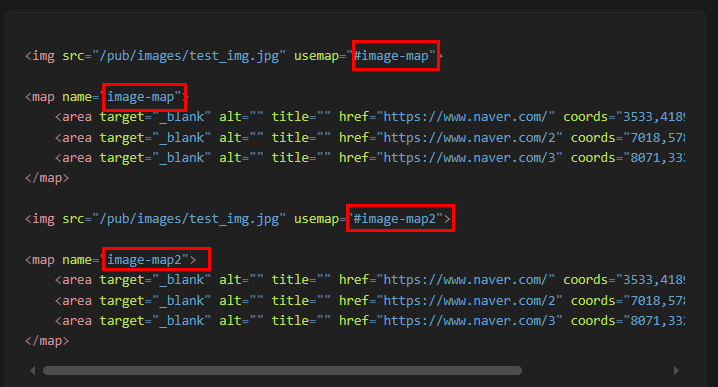

# 이미지맵

## 1. 문서 개요

- 기업명: 대량메일_레몬메일
- 문서 유형: 기타미분류
- 관련 사이트: 원본 내용 참조
- 관련 관리자 URL: 원본 내용 참조
- 원본 파일명: `이미지맵 36024050002281aaa874f65d5749bd14.md`
- 원본 경로: `기업별 유지보수 팁/인수인계/대량메일_레몬메일 (2)/이미지맵 36024050002281aaa874f65d5749bd14.md`
- 원본 SHA-256: `5d915aced7709b13eed0cc6a2cb6cb277f88a82f023af4c740fb16e8364073c9`
- 정리일: 20260514
- 확인 필요 여부: 예

## 2. 핵심 요약

- 원본 문서 `이미지맵 36024050002281aaa874f65d5749bd14.md`의 내용을 누락 없이 보존한 정리본입니다.
- 예상 기업명은 `대량메일_레몬메일`이며 문서 유형은 `기타미분류`으로 분류했습니다.
- 관련 이미지 1개를 `07_이미지_자료`에 복사하고 이 문서에 연결했습니다.
- 분류 또는 의미 확인이 필요한 문서입니다: 기업이 아닌 공통/업무 분류일 수 있어 확인 필요

## 3. 상세 내용

아래 내용은 원본 md 문서의 본문 전체입니다. 내용 누락 방지를 위해 원문 표현, 계정 정보, 경로, URL, 메모를 삭제하지 않고 보존했습니다.

# 이미지맵

[https://www.image-map.net/](https://www.image-map.net/)

1. 파일 첨부
2. **Shape → Rect**
3. Link 넣기
4. Target → _blank
5. 영역 잡기
6. 작업 후 Show Me The Code
7. 해당 소스 복사

> 적용 예시
> 

```jsx


<map name="image-map">
    <area target="_blank" alt="" title="" href="https://www.naver.com/" coords="3533,4189,5280,5557" shape="rect">
    <area target="_blank" alt="" title="" href="https://www.naver.com/2" coords="7018,5788,7797,6935" shape="rect">
    <area target="_blank" alt="" title="" href="https://www.naver.com/3" coords="8071,3326,9471,4568" shape="rect">
</map>


<map name="image-map2">
    <area target="_blank" alt="" title="" href="https://www.naver.com/" coords="3533,4189,5280,5557" shape="rect">
    <area target="_blank" alt="" title="" href="https://www.naver.com/2" coords="7018,5788,7797,6935" shape="rect">
    <area target="_blank" alt="" title="" href="https://www.naver.com/3" coords="8071,3326,9471,4568" shape="rect">
</map>
```

- map 태그 내 name과 적용하고자 하는 img태그 내 usemap와 맞춰줘야함


## 4. 작업 절차

- 원본 문서에 명시된 절차는 `## 3. 상세 내용` 및 `## 8. 원본 보존 내용`에 원문 그대로 보존되어 있습니다.
- 자동 정리 과정에서 절차를 임의로 재해석하거나 보완하지 않았습니다.

## 5. 주의사항

- 원본 문서에 포함된 주의사항, 예외사항, 계정 정보, 서버 정보, 경로, URL은 `## 3. 상세 내용`에 보존되어 있습니다.
- 자동 분류 결과는 검토용이며, 의미가 불분명한 항목은 확인 필요로 표시했습니다.

## 6. 오류 및 대응 방법

- 원본에 오류 사례 또는 대응 방법이 포함된 경우 `## 3. 상세 내용`에서 확인합니다.

## 7. 관련 이미지

| 이미지 파일명 | 설명 | 연결 경로 |
|---|---|---|
| `대량메일_레몬메일_이미지맵_image_20260514.png` | 원본 `기업별 유지보수 팁/인수인계/대량메일_레몬메일 (2)/이미지맵/image.png`에서 복사된 관련 이미지 | `./../07_이미지_자료/대량메일_레몬메일_이미지맵_image_20260514.png` |



- 이미지 설명: 원본 문서 또는 동일 이름 자산 폴더에 연결된 이미지입니다.
- 기존 이미지 파일명: `image.png`
- 기존 이미지 경로: `기업별 유지보수 팁/인수인계/대량메일_레몬메일 (2)/이미지맵/image.png`
- 유지보수 참고사항: 이미지 세부 내용은 담당자 확인 필요

## 8. 원본 보존 내용

- 원본 경로: `기업별 유지보수 팁/인수인계/대량메일_레몬메일 (2)/이미지맵 36024050002281aaa874f65d5749bd14.md`
- 원본 파일명: `이미지맵 36024050002281aaa874f65d5749bd14.md`
- 원본 SHA-256: `5d915aced7709b13eed0cc6a2cb6cb277f88a82f023af4c740fb16e8364073c9`

````markdown
# 이미지맵

[https://www.image-map.net/](https://www.image-map.net/)

1. 파일 첨부
2. **Shape → Rect**
3. Link 넣기
4. Target → _blank
5. 영역 잡기
6. 작업 후 Show Me The Code
7. 해당 소스 복사

> 적용 예시
> 

```jsx


<map name="image-map">
    <area target="_blank" alt="" title="" href="https://www.naver.com/" coords="3533,4189,5280,5557" shape="rect">
    <area target="_blank" alt="" title="" href="https://www.naver.com/2" coords="7018,5788,7797,6935" shape="rect">
    <area target="_blank" alt="" title="" href="https://www.naver.com/3" coords="8071,3326,9471,4568" shape="rect">
</map>


<map name="image-map2">
    <area target="_blank" alt="" title="" href="https://www.naver.com/" coords="3533,4189,5280,5557" shape="rect">
    <area target="_blank" alt="" title="" href="https://www.naver.com/2" coords="7018,5788,7797,6935" shape="rect">
    <area target="_blank" alt="" title="" href="https://www.naver.com/3" coords="8071,3326,9471,4568" shape="rect">
</map>
```

- map 태그 내 name과 적용하고자 하는 img태그 내 usemap와 맞춰줘야함


````

## 9. 확인 필요 사항

- 기업이 아닌 공통/업무 분류일 수 있어 확인 필요
- 이미지 내부 텍스트의 상세 판독은 자동 OCR을 수행하지 않았으므로 필요 시 담당자 확인 필요
