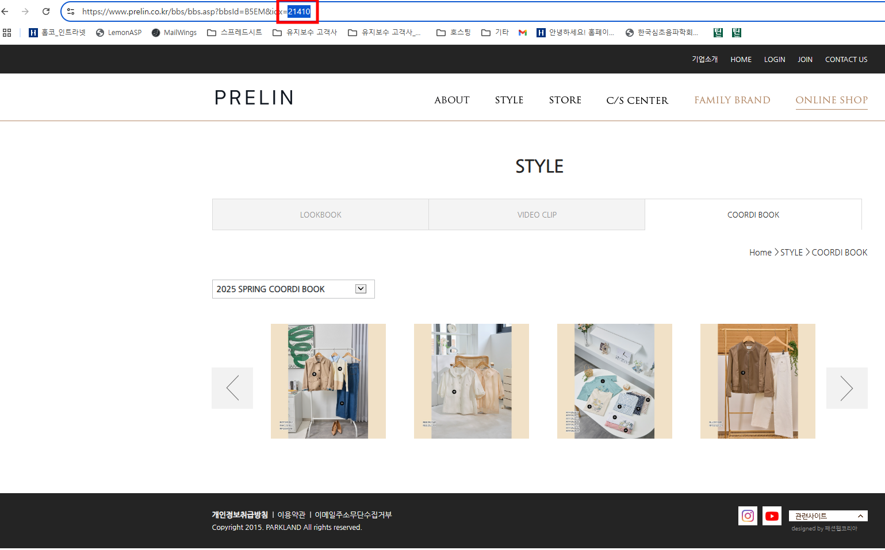
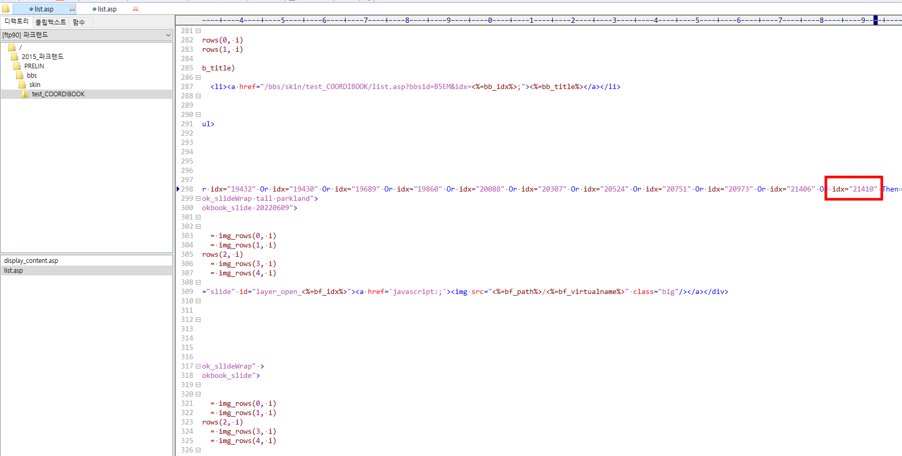

# 패밀리 브랜드

## 1. 문서 개요

- 기업명: 파크랜드
- 문서 유형: 관리자계정
- 관련 사이트: 원본 내용 참조
- 관련 관리자 URL: 원본 내용 참조
- 원본 파일명: `패밀리 브랜드 36024050002281d9aa46f4f4db5e3bd2.md`
- 원본 경로: `기업별 유지보수 팁/인수인계/파크랜드 (2)/패밀리 브랜드 36024050002281d9aa46f4f4db5e3bd2.md`
- 원본 SHA-256: `bbbf580b40052c50694d340104c7892d2e34c943f94e01a891270539616a0dc0`
- 정리일: 20260514
- 확인 필요 여부: 아니오

## 2. 핵심 요약

- 원본 문서 `패밀리 브랜드 36024050002281d9aa46f4f4db5e3bd2.md`의 내용을 누락 없이 보존한 정리본입니다.
- 예상 기업명은 `파크랜드`이며 문서 유형은 `관리자계정`으로 분류했습니다.
- 관련 이미지 2개를 `07_이미지_자료`에 복사하고 이 문서에 연결했습니다.

## 3. 상세 내용

아래 내용은 원본 md 문서의 본문 전체입니다. 내용 누락 방지를 위해 원문 표현, 계정 정보, 경로, URL, 메모를 삭제하지 않고 보존했습니다.

# 패밀리 브랜드

<aside>
💡

모바일도 수정해야됨

[https://m.parkland.co.kr/familybrand/prelin.asp](https://m.parkland.co.kr/familybrand/prelin.asp)

</aside>

_고객사에서 제공한 자료의 브랜드만 변경
_파크랜드 gnb header 상단 hover 이미지 ([http://www.parkland.co.kr/](http://www.parkland.co.kr/))
_파크랜드 하단 familybrand 롤링 배너 이미지 ([http://www.parkland.co.kr/](http://www.parkland.co.kr/))
_기업 하단 familybrand 롤링 배너 이미지 ([http://company.parkland.kr/](http://company.parkland.kr/))

**이미지 교체 경로**

2015_파크랜드/PARKLAND/familybrand/각 브랜드 명칭 파일

**비디오 교체 경로**

2015_파크랜드/PARKLAND/familybrand/각 브랜드 명칭 파일/swf/familybrand_mov/

프렐린 코디북 변경 시 해당 부분에서 슬라이드 이미지가 3,4개로 보여질 경우

[http://www.parkland.co.kr/familybrand/prelin.asp#coordi](http://www.parkland.co.kr/familybrand/prelin.asp#coordi)

> /2015_파크랜드/PRELIN/bbs/skin/test_COORDIBOOK/list.asp

- 298번에 idx값 추가

[http://www.prelin.co.kr/bbs/bbs.asp?bbsId=B5EM&idx=20088](http://www.prelin.co.kr/bbs/bbs.asp?bbsId=B5EM&idx=20088)

/2015_파크랜드/PRELIN/bbs/skin/LOOKBOOK/list.asp

- 286번 줄에 idx 값 추가


- idx값 확인

**카브리니 룩북 iframe url**

[https://www.cabrini.co.kr/bbs/skin/COORDIBOOK/list_1.asp?bbsId=UULC&idx=19653](https://www.cabrini.co.kr/bbs/skin/COORDIBOOK/list_1.asp?bbsId=UULC&idx=19653)

**제이하스 서브 비주얼 수정 시 iframe 경로로 이동하여 수정해야함**

/2015_파크랜드/JHASS/about/brand_190612.asp

## 4. 작업 절차

- 원본 문서에 명시된 절차는 `## 3. 상세 내용` 및 `## 8. 원본 보존 내용`에 원문 그대로 보존되어 있습니다.
- 자동 정리 과정에서 절차를 임의로 재해석하거나 보완하지 않았습니다.

## 5. 주의사항

- 원본 문서에 포함된 주의사항, 예외사항, 계정 정보, 서버 정보, 경로, URL은 `## 3. 상세 내용`에 보존되어 있습니다.
- 자동 분류 결과는 검토용이며, 의미가 불분명한 항목은 확인 필요로 표시했습니다.

## 6. 오류 및 대응 방법

- 원본에 오류 사례 또는 대응 방법이 포함된 경우 `## 3. 상세 내용`에서 확인합니다.

## 7. 관련 이미지

| 이미지 파일명 | 설명 | 연결 경로 |
|---|---|---|
| `파크랜드_패밀리_브랜드_image_1_20260514.png` | 원본 `기업별 유지보수 팁/인수인계/파크랜드 (2)/패밀리 브랜드/image 1.png`에서 복사된 관련 이미지 | `./../07_이미지_자료/파크랜드_패밀리_브랜드_image_1_20260514.png` |
| `파크랜드_패밀리_브랜드_image_20260514.png` | 원본 `기업별 유지보수 팁/인수인계/파크랜드 (2)/패밀리 브랜드/image.png`에서 복사된 관련 이미지 | `./../07_이미지_자료/파크랜드_패밀리_브랜드_image_20260514.png` |



- 이미지 설명: 원본 문서 또는 동일 이름 자산 폴더에 연결된 이미지입니다.
- 기존 이미지 파일명: `image 1.png`
- 기존 이미지 경로: `기업별 유지보수 팁/인수인계/파크랜드 (2)/패밀리 브랜드/image 1.png`
- 유지보수 참고사항: 이미지 세부 내용은 담당자 확인 필요



- 이미지 설명: 원본 문서 또는 동일 이름 자산 폴더에 연결된 이미지입니다.
- 기존 이미지 파일명: `image.png`
- 기존 이미지 경로: `기업별 유지보수 팁/인수인계/파크랜드 (2)/패밀리 브랜드/image.png`
- 유지보수 참고사항: 이미지 세부 내용은 담당자 확인 필요

## 8. 원본 보존 내용

- 원본 경로: `기업별 유지보수 팁/인수인계/파크랜드 (2)/패밀리 브랜드 36024050002281d9aa46f4f4db5e3bd2.md`
- 원본 파일명: `패밀리 브랜드 36024050002281d9aa46f4f4db5e3bd2.md`
- 원본 SHA-256: `bbbf580b40052c50694d340104c7892d2e34c943f94e01a891270539616a0dc0`

````markdown
# 패밀리 브랜드

<aside>
💡

모바일도 수정해야됨

[https://m.parkland.co.kr/familybrand/prelin.asp](https://m.parkland.co.kr/familybrand/prelin.asp)

</aside>

_고객사에서 제공한 자료의 브랜드만 변경
_파크랜드 gnb header 상단 hover 이미지 ([http://www.parkland.co.kr/](http://www.parkland.co.kr/))
_파크랜드 하단 familybrand 롤링 배너 이미지 ([http://www.parkland.co.kr/](http://www.parkland.co.kr/))
_기업 하단 familybrand 롤링 배너 이미지 ([http://company.parkland.kr/](http://company.parkland.kr/))

**이미지 교체 경로**

2015_파크랜드/PARKLAND/familybrand/각 브랜드 명칭 파일

**비디오 교체 경로**

2015_파크랜드/PARKLAND/familybrand/각 브랜드 명칭 파일/swf/familybrand_mov/

프렐린 코디북 변경 시 해당 부분에서 슬라이드 이미지가 3,4개로 보여질 경우

[http://www.parkland.co.kr/familybrand/prelin.asp#coordi](http://www.parkland.co.kr/familybrand/prelin.asp#coordi)

> /2015_파크랜드/PRELIN/bbs/skin/test_COORDIBOOK/list.asp

- 298번에 idx값 추가

[http://www.prelin.co.kr/bbs/bbs.asp?bbsId=B5EM&idx=20088](http://www.prelin.co.kr/bbs/bbs.asp?bbsId=B5EM&idx=20088)

/2015_파크랜드/PRELIN/bbs/skin/LOOKBOOK/list.asp

- 286번 줄에 idx 값 추가


- idx값 확인

**카브리니 룩북 iframe url**

[https://www.cabrini.co.kr/bbs/skin/COORDIBOOK/list_1.asp?bbsId=UULC&idx=19653](https://www.cabrini.co.kr/bbs/skin/COORDIBOOK/list_1.asp?bbsId=UULC&idx=19653)

**제이하스 서브 비주얼 수정 시 iframe 경로로 이동하여 수정해야함**

/2015_파크랜드/JHASS/about/brand_190612.asp
````

## 9. 확인 필요 사항

- 자동 정리 기준상 별도 확인 필요 사항 없음
- 이미지 내부 텍스트의 상세 판독은 자동 OCR을 수행하지 않았으므로 필요 시 담당자 확인 필요
