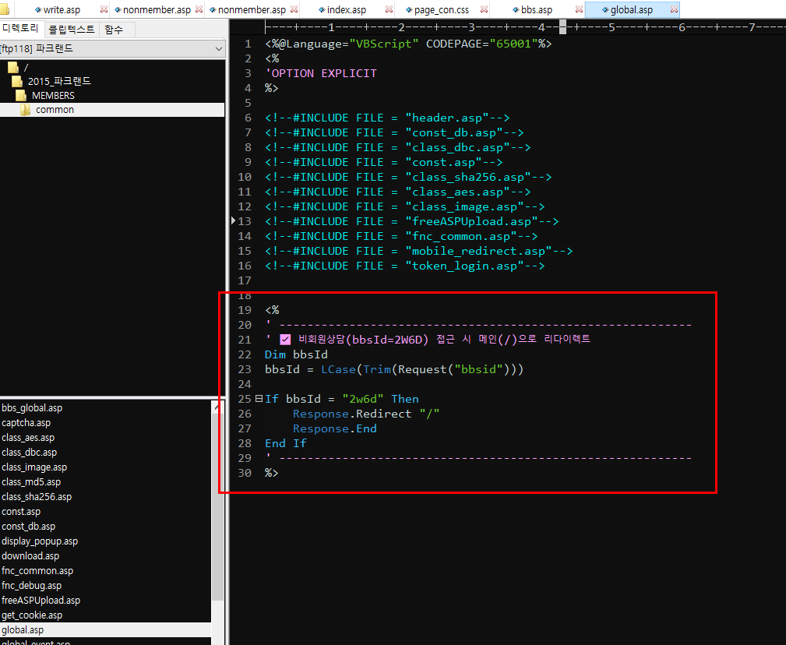
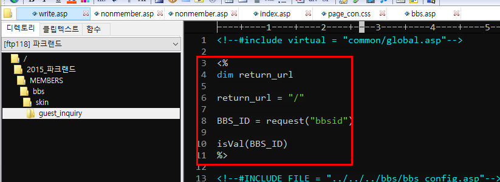
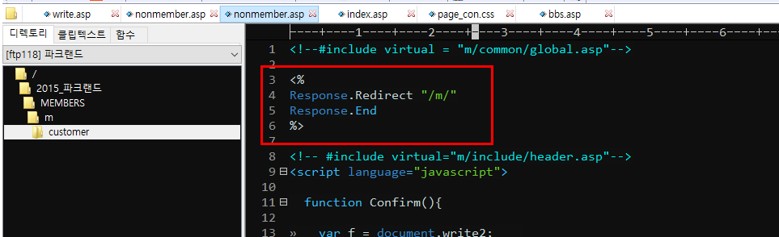
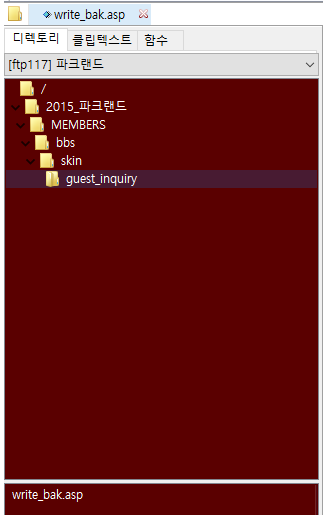

# 멤버스

## 1. 문서 개요

- 기업명: 파크랜드
- 문서 유형: 서버도메인
- 관련 사이트: 원본 내용 참조
- 관련 관리자 URL: 원본 내용 참조
- 원본 파일명: `멤버스 360240500022817995cbe129a947cfea.md`
- 원본 경로: `기업별 유지보수 팁/인수인계/파크랜드 (2)/멤버스 360240500022817995cbe129a947cfea.md`
- 원본 SHA-256: `702404ccac8537237cf1370391a92d5e5e3224be3f7641a0b92966db70d33ccf`
- 정리일: 20260514
- 확인 필요 여부: 아니오

## 2. 핵심 요약

- 원본 문서 `멤버스 360240500022817995cbe129a947cfea.md`의 내용을 누락 없이 보존한 정리본입니다.
- 예상 기업명은 `파크랜드`이며 문서 유형은 `서버도메인`으로 분류했습니다.
- 관련 이미지 4개를 `07_이미지_자료`에 복사하고 이 문서에 연결했습니다.

## 3. 상세 내용

아래 내용은 원본 md 문서의 본문 전체입니다. 내용 누락 방지를 위해 원문 표현, 계정 정보, 경로, URL, 메모를 삭제하지 않고 보존했습니다.

# 멤버스

**고객상담 경로**

ftp(91):/2015_파크랜드/MEMBERS/bbs/skin/guest_inquiry/write.asp


- 본사에서 페이지 삭제해달라 해서 아예 이름을 바꿔둔 상태

**타이틀 변경**

/2015_파크랜드/MEMBERS/include/sm.asp

상담문의(1:1, 비회원) 리다이렉트

/MEMBERS/bbs/skin/guest_inquiry/write.asp

/MEMBERS/common/global.asp

/MEMBERS/m/customer/nonmember.asp


회원 1:1 상담 경로(요청으로 폐쇄한 상태 - 메인으로 리다이렉트)

/MEMBERS/bbs/skin/my_inquiry/list.asp

## 4. 작업 절차

- 원본 문서에 명시된 절차는 `## 3. 상세 내용` 및 `## 8. 원본 보존 내용`에 원문 그대로 보존되어 있습니다.
- 자동 정리 과정에서 절차를 임의로 재해석하거나 보완하지 않았습니다.

## 5. 주의사항

- 원본 문서에 포함된 주의사항, 예외사항, 계정 정보, 서버 정보, 경로, URL은 `## 3. 상세 내용`에 보존되어 있습니다.
- 자동 분류 결과는 검토용이며, 의미가 불분명한 항목은 확인 필요로 표시했습니다.

## 6. 오류 및 대응 방법

- 원본에 오류 사례 또는 대응 방법이 포함된 경우 `## 3. 상세 내용`에서 확인합니다.

## 7. 관련 이미지

| 이미지 파일명 | 설명 | 연결 경로 |
|---|---|---|
| `파크랜드_멤버스_image_1_20260514.png` | 원본 `기업별 유지보수 팁/인수인계/파크랜드 (2)/멤버스/image 1.png`에서 복사된 관련 이미지 | `./images/파크랜드_멤버스_image_1_20260514.png` |
| `파크랜드_멤버스_image_2_20260514.png` | 원본 `기업별 유지보수 팁/인수인계/파크랜드 (2)/멤버스/image 2.png`에서 복사된 관련 이미지 | `./images/파크랜드_멤버스_image_2_20260514.png` |
| `파크랜드_멤버스_image_3_20260514.png` | 원본 `기업별 유지보수 팁/인수인계/파크랜드 (2)/멤버스/image 3.png`에서 복사된 관련 이미지 | `./images/파크랜드_멤버스_image_3_20260514.png` |
| `파크랜드_멤버스_image_20260514.png` | 원본 `기업별 유지보수 팁/인수인계/파크랜드 (2)/멤버스/image.png`에서 복사된 관련 이미지 | `./images/파크랜드_멤버스_image_20260514.png` |



- 이미지 설명: 원본 문서 또는 동일 이름 자산 폴더에 연결된 이미지입니다.
- 기존 이미지 파일명: `image 1.png`
- 기존 이미지 경로: `기업별 유지보수 팁/인수인계/파크랜드 (2)/멤버스/image 1.png`
- 유지보수 참고사항: 이미지 세부 내용은 담당자 확인 필요



- 이미지 설명: 원본 문서 또는 동일 이름 자산 폴더에 연결된 이미지입니다.
- 기존 이미지 파일명: `image 2.png`
- 기존 이미지 경로: `기업별 유지보수 팁/인수인계/파크랜드 (2)/멤버스/image 2.png`
- 유지보수 참고사항: 이미지 세부 내용은 담당자 확인 필요



- 이미지 설명: 원본 문서 또는 동일 이름 자산 폴더에 연결된 이미지입니다.
- 기존 이미지 파일명: `image 3.png`
- 기존 이미지 경로: `기업별 유지보수 팁/인수인계/파크랜드 (2)/멤버스/image 3.png`
- 유지보수 참고사항: 이미지 세부 내용은 담당자 확인 필요



- 이미지 설명: 원본 문서 또는 동일 이름 자산 폴더에 연결된 이미지입니다.
- 기존 이미지 파일명: `image.png`
- 기존 이미지 경로: `기업별 유지보수 팁/인수인계/파크랜드 (2)/멤버스/image.png`
- 유지보수 참고사항: 이미지 세부 내용은 담당자 확인 필요

## 8. 원본 보존 내용

- 원본 경로: `기업별 유지보수 팁/인수인계/파크랜드 (2)/멤버스 360240500022817995cbe129a947cfea.md`
- 원본 파일명: `멤버스 360240500022817995cbe129a947cfea.md`
- 원본 SHA-256: `702404ccac8537237cf1370391a92d5e5e3224be3f7641a0b92966db70d33ccf`

````markdown
# 멤버스

**고객상담 경로**

ftp(91):/2015_파크랜드/MEMBERS/bbs/skin/guest_inquiry/write.asp


- 본사에서 페이지 삭제해달라 해서 아예 이름을 바꿔둔 상태

**타이틀 변경**

/2015_파크랜드/MEMBERS/include/sm.asp

상담문의(1:1, 비회원) 리다이렉트

/MEMBERS/bbs/skin/guest_inquiry/write.asp

/MEMBERS/common/global.asp

/MEMBERS/m/customer/nonmember.asp


회원 1:1 상담 경로(요청으로 폐쇄한 상태 - 메인으로 리다이렉트)

/MEMBERS/bbs/skin/my_inquiry/list.asp
````

## 9. 확인 필요 사항

- 자동 정리 기준상 별도 확인 필요 사항 없음
- 이미지 내부 텍스트의 상세 판독은 자동 OCR을 수행하지 않았으므로 필요 시 담당자 확인 필요
